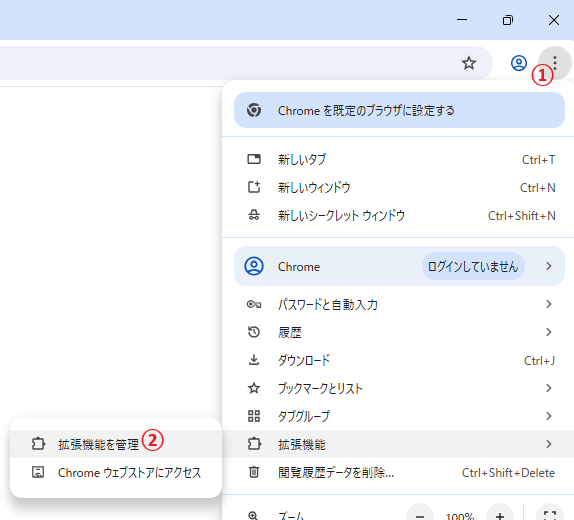
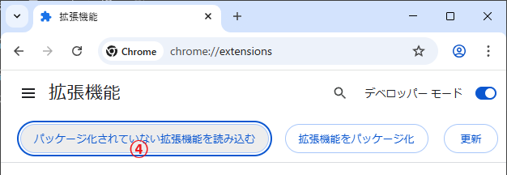

# NetflixTimeTrackerExtension

- Netflixの動画視聴ページで再生時間を表示するChrome拡張機能です  
ChromeベースのWebブラウザであれば恐らく機能すると思います

- 表示されない場合はページの更新を試してください

- 作成現在では動作を確認済みですが、Netflixの動画視聴ページに変更があった場合動作しなくなる可能性があります

## インストール手順

- 最新のReleaseからNetflixTimeTrackerExtension.zipをダウンロード  
任意のフォルダに解凍

- Chromeのメニューから拡張機能の管理を表示

- デベロッパーモードを有効化

- 「パッケージ化されていない拡張機能を読み込む」から  
手順の最初にダウンロード＆解凍したフォルダを指定

- 任意のNetflix動画視聴ページを開く  
(表示されない場合は一度更新を試してください)